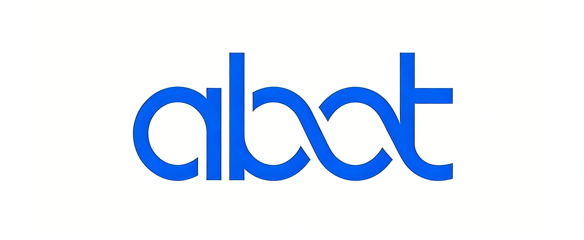

<div align="center">
  
  <h1>abot</h1>
  <p><strong>Agent Engineering Lab</strong></p>
  <p>面向 Agent 工程实践的轻量、可控、可演进框架</p>
</div>

<div align="center">
  
  
  
  
</div>

---

<div align="center">

[项目定位](#项目定位) · [快速开始](#快速开始) · [通道配置](#通道配置) · [常用命令](#常用命令) · [Agent 工程实现](#agent-工程实现) · [致谢](#致谢)

</div>

---

## 项目定位

`abot` 是一个聚焦 Agent 工程实验的框架，核心目标是把"能跑"升级为"可复现、可评估、可维护"。

### 核心能力

| 模块 | 说明 |
| --- | --- |
| **核心能力** | `agent loop` / `tools` / `skills` / `cron` / `heartbeat` / `MCP` |
| **重点通道** | `CLI` / `Telegram` / `飞书` / `QQ OneBot` |
| **工程目标** | 可复现、可评估、可维护的 Agent 实验框架 |
| **设计方向** | 精简生态干扰，强调可控性与演进速度 |

### 设计理念

- 保留核心能力：agent loop、tools、skills、cron、heartbeat、MCP
- 保留高价值通道：CLI、Telegram、飞书、QQ（OneBot）
- 移除与当前研究目标弱相关的生态模块，降低复杂度与维护成本

---

## 快速开始

### 1. 安装

```bash
git clone https://github.com/VITOHJL/abot.git
cd abot
pip install -e .
```

### 2. 初始化

```bash
python -m abot onboard
```

### 3. 配置模型

编辑 `~/.abot/config.json`：

```json
{
  "providers": {
    "openrouter": {
      "apiKey": "sk-or-v1-xxx"
    }
  },
  "agents": {
    "defaults": {
      "model": "anthropic/claude-opus-4-5",
      "provider": "openrouter"
    }
  }
}
```

> **获取 API Key**: [OpenRouter](https://openrouter.ai/keys) (推荐) | [Brave Search](https://brave.com/search/api/) (可选，用于网页搜索)

### 4. 开始对话

```bash
# CLI 交互模式
python -m abot agent

# 或发送单条消息
python -m abot agent -m "Hello!"
```

---

## 通道配置

> [!TIP]
> 当前推荐仅启用你实际使用的通道，减少运维噪音与排障面。

### Telegram

```json
{
  "channels": {
    "telegram": {
      "enabled": true,
      "token": "YOUR_BOT_TOKEN",
      "allowFrom": ["YOUR_USER_ID"]
    }
  }
}
```

获取 Bot Token: 在 Telegram 搜索 `@BotFather`，发送 `/newbot` 创建机器人。

### 飞书

```json
{
  "channels": {
    "feishu": {
      "enabled": true,
      "appId": "cli_xxx",
      "appSecret": "xxx",
      "allowFrom": ["ou_xxx"]
    }
  }
}
```

获取凭证: 在[飞书开放平台](https://open.feishu.cn/)创建应用。

### QQ（OneBot）

```json
{
  "channels": {
    "qq": {
      "enabled": true,
      "apiUrl": "http://127.0.0.1:5700",
      "wsReverseUrl": "ws://127.0.0.1:8080/ws/reverse",
      "botQq": 123456789,
      "accessToken": "",
      "allowFrom": ["*"]
    }
  }
}
```

推荐适配器: [Lagrange.onebot](https://github.com/LagrangeDev/Lagrange.Core) / [NapCat](https://github.com/NapNeko/NapCat)

---

## 常用命令

```bash
# 启动网关（连接所有启用的通道）
python -m abot gateway

# 查看状态
python -m abot status

# 查看通道状态
python -m abot channels status

# OAuth 登录（OpenAI Codex / GitHub Copilot）
python -m abot provider login openai-codex
python -m abot provider login github-copilot
```

---

## Agent 工程实现

`abot` 在工程实践中解决了以下关键问题：

| 工程挑战 | 处理方式 |
| --- | --- |
| **长对话上下文膨胀** | 基于 token 预算触发压缩：`budget = max_tokens_input - max_tokens - reserve`，用 `compression_start_ratio` / `compression_target_ratio` 控制启停；按 token 选择历史 chunk 做 consolidation，后台异步执行。 |
| **压缩后如何保持可追溯** | 不直接改写会话消息，使用 `_compressed_until` 记录连续压缩边界，仅在推理时构造压缩视图；原始记录保留，摘要写入 `memory/HISTORY.md` 和 `memory/MEMORY.md`。 |
| **Token 统计口径不一致** | 优先用模型 `usage`（`total_tokens` 或 `prompt_tokens + completion_tokens`）；不足时退化到 provider token counter，再退化到 `tiktoken`。 |
| **长会话持久化与兼容迁移** | 会话保存为 `sessions/*.jsonl`（首行 metadata + 后续消息）；消息模型保持 append-only；检测到旧目录 `~/.abot/sessions` 时自动迁移。 |
| **记忆写入稳定性** | 通过 `save_memory` 工具调用统一落盘；对 provider 返回参数做防御式解析（dict/string/list）以避免格式差异造成写入失败。 |
| **工具执行安全与稳健** | 工具参数先做 schema cast + validate；过长 tool result 写入会话前截断；可开启 `restrict_to_workspace` 限制文件/执行工具作用域。 |
| **运行时可控性** | 每条消息独立 task；`/stop` 可取消当前会话活跃任务、后台压缩和 subagent；MCP 使用懒连接与失败清理，后续消息可自动重试。 |
| **能力扩展与上下文平衡** | Skills 采用"摘要进系统提示 + 按需读取 `SKILL.md` + always 技能自动注入"的渐进加载方式，兼顾能力覆盖与上下文成本。 |

---

## 致谢

- `abot` 最初基于 [`HKUDS/nanobot`](https://github.com/HKUDS/nanobot) 分叉
- 感谢 nanobot 维护者与贡献者提供的架构基础和开源工作
- `abot` 当前沿着自身路线持续演进，重点聚焦 Agent 工程实验场景

### 贡献者

感谢每一位参与者的贡献！

<div align="center">
  <a href="https://github.com/VITOHJL/abot/graphs/contributors">
    
  </a>
</div>

---

<div align="center">
  <a href="https://star-history.com/#VITOHJL/abot&Date">
    
  </a>
</div>

---

<div align="center">
  <sub>MIT License | Made by <a href="https://github.com/VITOHJL">VITOHJL</a></sub>
</div>
